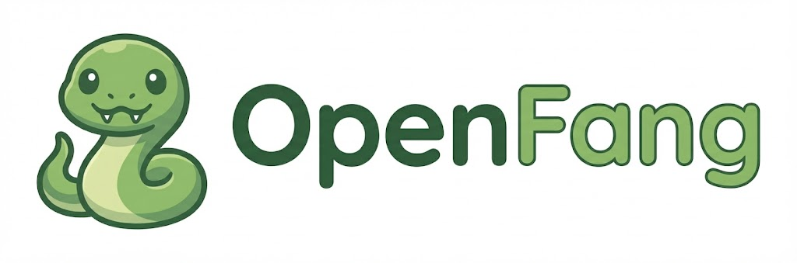

<p align="center">
  
</p>

<p align="center" style="font-size: 1.4em; color: #4B8BBE;">
  <strong>Your AI assistant, wherever you chat</strong>
</p>

<p align="center">
  <a href="https://github.com/aidiss/openfang"></a>
  <a href="https://github.com/aidiss/openfang"></a>
</p>

---

**OpenFang** is a lightweight AI agent gateway inspired by [OpenClaw](https://openclaw.ai). It connects LLMs to your messaging channels with tools, skills, and persistent memory — all in ~5K lines of Python.

Run it locally. Own your data. Extend it freely.

## Quick Start

```bash
# Install with uv
uv sync

# Start the gateway
uv run openfang gateway

# Or chat directly in terminal
uv run openfang chat
```

The gateway runs at [localhost:18789](http://localhost:18789) with a web UI for chat, sessions, and configuration.

## What It Does

<div class="grid cards" markdown>

-   :material-chat-outline: **Multi-Channel Inbox**

    ---

    Connect Telegram, Discord, and more. One assistant, all your chats.

-   :material-brain: **Persistent Memory**

    ---

    Remembers context across conversations. Your assistant learns your preferences.

-   :material-tools: **Powerful Tools**

    ---

    Files, shell, web browsing, cron jobs. The assistant can actually do things.

-   :material-puzzle-outline: **Extensible Skills**

    ---

    Add capabilities via Markdown files. No code required for new skills.

-   :material-api: **FastAPI Gateway**

    ---

    REST API + WebSocket events. Build on top of it.

-   :material-shield-check: **Role-Based Permissions**

    ---

    Control who can use dangerous tools. Admin, developer, or open access.

</div>

## Channels

| Channel | Status | Notes |
|---------|--------|-------|
| **Telegram** | :material-check-circle:{ .green } Ready | Full support with bot token |
| **Discord** | :material-check-circle:{ .green } Ready | Slash commands + DMs |
| **WhatsApp** | :material-clock-outline: Planned | Coming soon |
| **Slack** | :material-clock-outline: Planned | Coming soon |
| **Signal** | :material-clock-outline: Planned | Coming soon |

## Configuration

Environment variables or `.env` file:

```bash
# Required: LLM provider
OPENAI_API_KEY=sk-...              # Or use Anthropic

# Channels (add tokens to enable)
OPENFANG_TELEGRAM_BOT_TOKEN=...    # From @BotFather
OPENFANG_DISCORD_BOT_TOKEN=...     # From Discord Developer Portal

# Server
OPENFANG_HOST=0.0.0.0
OPENFANG_PORT=18789
```

## Architecture

```
src/openfang/
├── adapters/          # Implementations
│   ├── channels/      # Telegram, Discord, ...
│   └── skills/        # Markdown skill definitions
├── gateway/           # FastAPI server + web UI
├── routing/           # Message dispatcher
├── protocols.py       # Port interfaces (hexagonal)
├── deps.py            # Dependency injection
├── agent.py           # pydantic-ai agent factory
├── tools.py           # ~40 agent tools
└── chat.py            # Conversation management
```

Built on:

- **[pydantic-ai](https://ai.pydantic.dev/)** — Agent framework with type safety
- **[FastAPI](https://fastapi.tiangolo.com/)** — Async HTTP server
- **[HTMX](https://htmx.org/)** + **[Alpine.js](https://alpinejs.dev/)** — Lightweight reactive UI

## Why OpenFang?

OpenClaw is incredible — 314K lines of TypeScript, 50+ skills, native apps for every platform. But sometimes you want:

- **Simpler**: ~5K lines, pure Python, easy to understand
- **Hackable**: Fork it, extend it, make it yours
- **Lightweight**: No native apps, no complex build system
- **Pythonic**: If you think in Python, you'll feel at home

OpenFang is OpenClaw's little sibling. Same spirit, smaller footprint.

## Next Steps

- [API Reference](api.md) — Auto-generated docs from source
- [GitHub](https://github.com/aidiss/openfang) — Source code and issues
